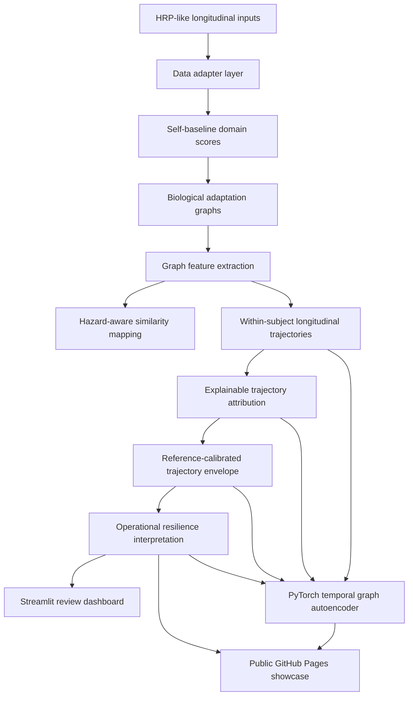

# NeuroBridge-S4 Architecture

NeuroBridge-S4 is a transparent, within-subject pipeline that turns HRP-like longitudinal inputs
into baseline-relative biological graph trajectories, interpretable resilience interpretation, and a
PyTorch self-supervised representation-learning showcase.

## Data flow diagram (Mermaid)



## Plain-text fallback

```
HRP-like inputs
  -> data adapter layer
  -> self-baseline domain scores
  -> biological adaptation graphs
  -> graph features --> hazard-aware similarity mapping
  -> within-subject longitudinal trajectories
  -> explainable attribution
  -> reference-calibrated envelope
  -> operational resilience interpretation
  -> review dashboard
  -> PyTorch temporal graph autoencoder
  -> public showcase
```

## Component descriptions

- **Data adapter layer** (`data_adapters.py`, `data_validation.py`, `domain_mapping.py`,
  `adapter_reporting.py`): validates heterogeneous HRP-like inputs, maps variables to biological
  domains, standardizes, and computes baseline-relative domain scores in a graph-ready format.
- **Biological adaptation graphs** (`graph_build.py` and related): builds within-subject graphs
  whose nodes are biological domains and whose structure encodes adaptation relationships.
- **Graph feature extraction** (`features.py`): extracts node- and graph-level features.
- **Hazard-aware similarity mapping** (`hazard_mapping.py`, `similarity.py`, `embeddings.py`):
  aligns graph features with the NASA HRP five-hazard framework as context for review (alignment,
  not exposure).
- **Within-subject longitudinal trajectories** (`longitudinal.py`, `trajectory_features.py`):
  tracks change from each subject's own baseline across mission phases.
- **Explainable trajectory attribution** (`trajectory_*` modules): transparent arithmetic that
  attributes change to domains, subgraphs, hazards, and recovery components.
- **Reference-calibrated trajectory envelope**: calibrates change magnitude against reference
  variability using robust statistics (median, MAD, robust z-scores).
- **Operational resilience interpretation** (`resilience_rules.py`, `resilience_interpretation.py`,
  `resilience_reporting.py`, `resilience_visualization.py`): rule-based, evidence-chain
  interpretation of adaptive resilience state and dominant adaptation mode, for expert review.
- **Streamlit review dashboard** (`app.py`, `dashboard_data.py`, `dashboard_components.py`):
  interactive longitudinal review interface (local, not hosted on Pages).
- **PyTorch temporal graph autoencoder** (`torch_dataset.py`, `torch_autoencoder.py`,
  `torch_training.py`, `torch_reporting.py`, `torch_showcase.py`): self-supervised representation
  learning over graph-derived trajectory feature vectors.
- **Public GitHub Pages showcase** (`docs/index.html`, `docs/phase12_pytorch_showcase.html`):
  zero-install static site for reviewers.

## Output flow

- Tabular outputs: `results/tables/`
- Figures: `results/figures/`
- Reports and model card: `results/reports/`
- Trained model: `results/models/`
- Local HTML showcase: `results/html/`
- Published public site: `docs/`

## Where the PyTorch layer fits

The PyTorch layer sits on top of the transparent analytical pipeline. It consumes the graph-derived,
baseline-relative trajectory features (Phases 6-8) and the Phase 11 resilience annotations, and
learns compact latent representations via reconstruction objectives. It complements — and does not
replace — the rule-based pipeline. It is an experimental representation-learning prototype, not a
clinical predictor, risk score, or mission-readiness classifier.

## Where the dashboard fits

The Streamlit dashboard is a local review surface over the Phase 6-11 outputs. It is intended for
technical reviewers running the project locally; the public GitHub Pages site is the zero-install
alternative for non-programmer reviewers.

## Guardrails

This architecture is a research engineering prototype. It is not diagnosis, treatment guidance,
health risk scoring, exposure measurement, mission readiness classification, or an operational
medical decision system.
